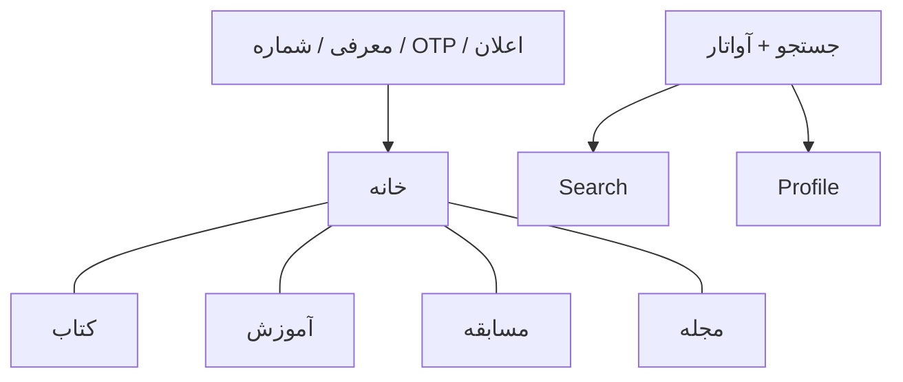

# برنامه جامع طراحی — فرهنگی (Farhangi) نسخه ۲

> مرجع طراحی و معماری اپ. الگوها از ریپازیتوری‌های مرجع **یاد گرفته** می‌شوند، کد کپی نمی‌شود.
> نسخه ۱ اسکلت MVP بود. این سند نسخه ۲ را جایگزین می‌کند.

---

## ۱) Product Thinking

### ۱.۱ ماموریت

پلتفرم فرهنگی فارسی برای پرسنل، خانواده و عموم مردم: مطالعه، آموزش، رقابت سالم و محتوای روزانه.
سازمان دولتی و مذهبی با مأموریت فرهنگی — لحن حرفه‌ای، آرام، قابل اعتماد. بدون جلوه‌های بازی‌وار ارزان.

### ۱.۲ محدوده امن

- هیچ محتوای نظامی، طبقه‌بندی‌شده یا اتوماسیون سازمانی.
- بخش «سازمانی» فقط پیام و اطلاعیه داخلی بین سطح سازمانی و مدیرکل است، نه سامانه اداری.

### ۱.۳ کاربران و نقش‌ها

| نقش | دسترسی |
|-----|--------|
| کاربر | همه محتوای عمومی، مطالعه، آموزش، مسابقه، مجله، هم‌خوان |
| ویرایشگر | محتواگذاری و ویرایش کتاب، آموزش، مجله، مسابقه |
| سازمانی | پیام‌ها و اطلاعیه‌های داخلی با مدیرکل (جزئیات بعداً تکمیل می‌شود) |
| مدیرکل | همه دسترسی‌ها + تغییر سمت دیگران + گزارش‌ها |

در دمو: شماره عادی = کاربر؛ `09111111111` ویرایشگر؛ `09222222222` سازمانی؛ `09333333333` مدیرکل. کد OTP آزمایشی `123456`.

### ۱.۴ معیار موفقیت نسخه ۲

- ورود اول: معرفی → شماره → OTP → اجازه اعلان → خانه.
- پنج مقصد منو: خانه، کتاب، آموزش، مسابقه، مجله. پروفایل از آواتار نوار بالا.
- هر دامنه یک مسیر کامل قابل لمس در شبیه‌ساز با داده دمو.
- پنل نقش‌محور در پروفایل برای ویرایشگر / سازمانی / مدیرکل.

---

## ۲) UX Thinking

### ۲.۱ ناوبری سطح‌بالا

پروفایل تب ششم نیست. جستجو تب نیست.

### ۲.۲ کتاب

قطب چهار درگاه:

1. **کتابخانه** — آرشیو موضوعی، مطالعه آنلاین PDF (در دمو: صفحات نمونه کتاب).
2. **کتاب‌خانه من** — ذخیره‌شده برای بعد.
3. **مسابقات کتاب** — مسابقه‌های مرتبط با کتاب (در جریان / تمام‌شده).
4. **هم‌خوان** — باشگاه مطالعه: امتیاز به‌ازای دقیقه مطالعه؛ جدول ۱۰ نفر هفته و ماه؛ جام در پروفایل.

امتیازات جداگانه (مطالعه، آموزش، مسابقه، مجله) و جدول کلی.

### ۲.۳ آموزش

- **تخصصی:** چند جلسه، مسیر، ویدیو آپارات یا متن+تصویر، درصد پیشرفت. فعلاً رایگان؛ پرچم پولی برای آینده.
- **کاربردی:** یک محتوا، موضوع گسترده‌تر.
- هر کدام: صفحه دسته‌بندی + صفحه تکی قالب.

### ۲.۴ مسابقه (تب سراسری)

همه مسابقه‌ها با برچسب (کتاب، سبک زندگی، اطلاعات عمومی، دوره‌های کاربردی، …). نتایج مسابقات تمام‌شده همین‌جا. مسابقه کتاب در قطب کتاب هم دیده می‌شود.

سؤال‌ها در وحله اول چهارگزینه‌ای.

### ۲.۵ مجله

وبلاگ روزانه. دسته‌ها: فرهنگی، خانواده، اخبار، اقتصادی، سیاسی، کتابخوانی، هنری، تاریخ، روایت.

### ۲.۶ خانه

خلاصه وضعیت: امتیاز و رتبه هم‌خوان، ادامه مطالعه، ادامه آموزش، مسابقه فعال، تازه‌های مجله، نقل قول روز.

### ۲.۷ اولین ورود

1. معرفی چهار ویژگی (کتاب، آموزش، مسابقه، مجله).
2. شماره تماس.
3. تأیید کد.
4. آماده‌سازی اعلان: «دسترسی می‌دهم» / «بعداً».
5. خانه.

کاربر برگشتی با نشست معتبر، معرفی و اعلان را نمی‌بیند.

---

## ۳) UI Thinking

- فقط Material Design 3. Seed `#0F6E56`. Vazirmatn. RTL. فاصله ۴dp.
- قطب‌ها با کاشی تعاملی (نه کارت تزئینی).
- گیمیفیکیشن: سطح و جام آرام، نه آر케이ج.
- نمودار گزارش مدیرکل: نوار ساده Compose روی توکن‌های M3.
- دسترس‌پذیری: هدف لمس ۴۸dp، برچسب آیکن، کنتراست AA.

---

## ۴) Architecture

### ۴.۱ ماژول‌ها

موجود: auth, home, books, courses, magazine, profile, search + core.

جدید:

- `feature/competitions/{api,impl}` — تب مسابقه و آزمون.
- `feature/studio/{api,impl}` — استودیوی ویرایشگر، صندوق سازمانی، گزارش و سمت‌ها.

### ۴.۲ قرارداد بک‌اند

`AuthGateway` و `ContentGateway` باقی می‌مانند.
اضافه:

- `EngagementGateway` — مسابقه، امتیاز، جدول، جام، کتاب‌خانه من.
- `StudioGateway` — محتواگذاری، پیام سازمانی، گزارش، تغییر نقش.

پیاده‌سازی فعلی دمو؛ UI/Domain به SDK وابسته نیست.

### ۴.۳ ناوبری

Navigation 3 + چند پشته برای پنج تب.
مقاصد پروفایل/استودیو روی پشته فعال هل می‌شوند.

---

## ۵) Risks

| ریسک | راهکار |
|------|--------|
| CMS کامل در اندروید سنگین است | استودیو با فرم‌های واقعی روی store دمو؛ همگام‌سازی سرور بعدی |
| PDF آنلاین | مدل `pdfUrl` + خواننده صفحه‌ای برای دمو؛ PdfRenderer در فاز بعد |
| تقلب تایمر مطالعه | فعلاً دقیقه نمایشی دمو؛ ضدتقلب سروری بعداً |
| نقش سازمانی ناتمام | صندوق پیام قالب؛ منطق سازمانی فاز بعد |
| کوپل Supabase | Gateway جدا؛ adapter فعلی دست‌نخورده با فیلدهای پیش‌فرض |

---

## ۶) Suggestions

- داده دمو غنی برای شبیه‌ساز، بدون وابستگی به شبکه.
- نقش دمو با شماره مشخص برای تست پنل‌ها.
- پس از تأیید روی شبیه‌ساز: کامیت و پوش به GitHub `farhangi` — فقط با درخواست صریح.

---

## ۷) Implementation Plan

1. مدل دامنه، Gateway، store دمو، Repository.
2. ناوبری پنج‌تب + آواتار + جریان ورود اول.
3. قطب کتاب، خواننده، هم‌خوان، کتاب‌خانه من.
4. قالب آموزش و مجله.
5. تب مسابقه و آزمون چهارگزینه‌ای.
6. خانه با امتیاز.
7. پروفایل نقش‌محور + استودیو + صندوق سازمانی + گزارش مدیرکل.
