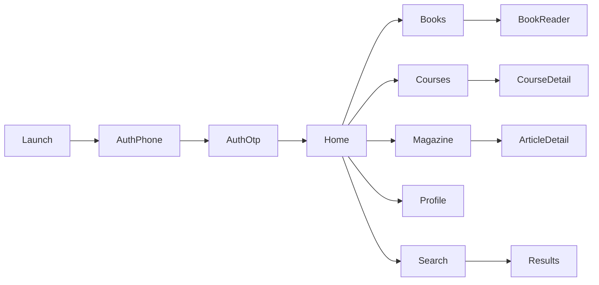
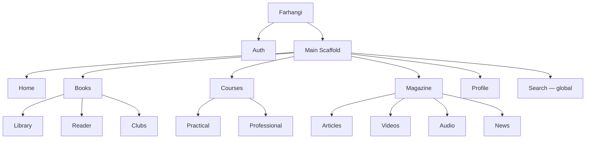
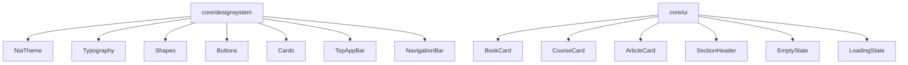
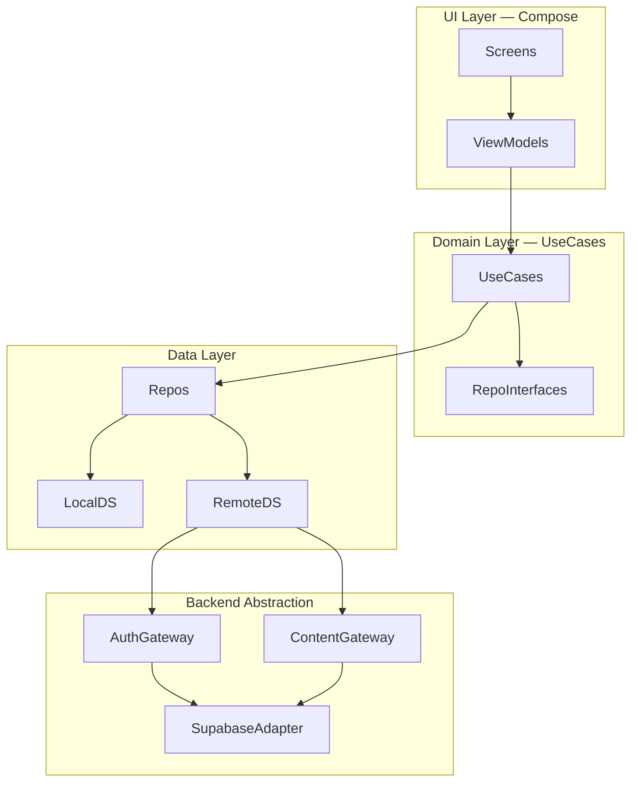

# برنامه جامع طراحی — اپلیکیشن فرهنگی (Farhangi)

> این سند مرجع کامل طراحی و معماری اپ است. عامل بیلد باید **فقط** طبق این سند پیش برود.
> الگوها از ریپازیتوری‌های مرجع **یاد گرفته** می‌شوند، کد کپی نمی‌شود.

---

## ۱) Product Thinking

### ۱.۱ ماموریت

پلتفرم فرهنگی یکپارچه (Super App) که محتوای عمومی فرهنگی را در قالب کتاب، دوره، مجله و محتوای چندرسانه‌ای عرضه می‌کند.

### ۱.۲ کاربران

| کاربر | نیاز اصلی |
|-------|-----------|
| پرسنل نظامی | دسترسی آسان به محتوای فرهنگی در زمان آزاد |
| خانواده‌ها | محتوای آموزشی و خواندنی برای کل خانواده |
| عموم مردم | کتاب، دوره، مجله در یک اپ |

### ۱.۳ محدوده امن (Hard Boundaries)

- **هیچ** محتوای نظامی، طبقه‌بندی‌شده یا محرمانه.
- **هیچ** اتوماسیون سازمانی یا سیستم داخلی.
- همه‌چیز محتوای فرهنگی عمومی و قابل انتشار.

### ۱.۴ MVP (فاز ۱) در برابر آینده

| فاز | محدوده |
|-----|--------|
| **MVP** | Auth (Phone+OTP) + اسکلت ناوبری + Home + یک مسیر کامل از هر دامنه (کتاب/دوره/مجله) + Profile پایه + Search سراسری |
| آینده | آفلاین، صوتی، Push، AI Search، توصیه‌گر، Dark Theme، Widgets، Wear OS، Tablet |

### ۱.۵ معیار موفقیت

- ورود سریع (OTP ≤ ۳۰ ثانیه).
- دسترسی به محتوا در ≤ ۲ تاپ از Home.
- خواندن روان کتاب بدون افت فریم.
- تجربه یکپارچه RTL فارسی.

---

## ۲) UX Thinking

### ۲.۱ سفرهای کاربری اصلی



### ۲.۲ Information Architecture



### ۲.۳ فلوهای کلیدی

#### احراز هویت

1. Splash → بررسی Session.
2. اگر Session معتبر → Home.
3. وگرنه → ورود شماره تلفن → ارسال OTP → تأیید → home.
4. قبل از لاین، فقط Auth در دسترس؛ بعد از آن همه بخش‌ها.

#### کتاب

- Library → BookDetail → Reader.
- Reader: ادامه از آخرین صفحه، bookmark، highlight، پیشرفت خواندن، حالت شب.
- Reading Goal و Statistics در Profile.

#### دوره

- دو تجربه متمایز:
  - **Practical Learning:** تک‌درس، مصرف سریع، چیدمان کارت.
  - **Professional Courses:** مسیر یادگیری، CourseDetail، بخش‌ها، پیشرفت، تکمیل، تاریخچه، آمادگی برای گواهی آینده.

#### جستجو

- جستجوی سراسری از Top App Bar.
- فیلتر: Books / Courses / Articles / Videos / Audio.

### ۲.۴ اصول UX

- قبل از طراحی فکر کن.
- سفر کاربری کامل طراحی کن.
- کمترین تعداد کلیک.
- از اسکرین‌های بی‌هدف پرهیز کن.
- هر اسکرین یک هدف روشن داشته.
- **سازگاری الزامی است.**

---

## ۳) UI Thinking

### ۳.۱ زبان بصری

- Material Design 3 — تنها زبان طراحی مجاز.
- Minimal، Elegant، Professional، Timeless.
- بدون noise بصری؛ کارایی بر تزئین.

### ۳.۲ توکن‌ها

#### رنگ

| Role | مقدار (fallback) |
|------|------------------|
| primary | M3 seed-based |
| onPrimary | M3 |
| surface | M3 |
| onSurface | M3 |
| surfaceVariant | M3 |
| outline | M3 |
| error | M3 |

پشتیبانی از Dynamic Color در Android 12+ با fallback ثابت.

#### تایپوگرافی

| مقیاس | اندازه | وزن |
|--------|--------|-----|
| Display | 36–57sp | 400 |
| Headline | 24–32sp | 400 |
| Title | 14–22sp | 500 |
| Body | 14–16sp | 400 |
| Label | 11–12sp | 500 |

فونت: **Vazirmatn** (Variable) برای همه مقیاس‌ها.

#### Shape

مقیاس M3: xs(4dp) · sm(8dp) · md(12dp) · lg(16dp) · xl(28dp) · full(50%).

#### Elevation

سطوح M3 level 0–5. ترجیح surface tonal elevation به shadow.

#### Spacing

Grid 4dp: 4 · 8 · 12 · 16 · 24 · 32. بدون عدد جادویی.

### ۳.۳ RTL و فارسی

- `LayoutDirection.Rtl` سراسری.
- اعداد و تاریخ شمسی مطابق قرارداد فارسی.
- آیکن‌های جهت‌دار RTL-aware.

### ۳.۴ درخت کامپوننت (خلاصه)



### ۳.۵ دسترس‌پذیری

- touch target ≥ 48dp.
- کنترل‌های آیکن‌محور `contentDescription` یا `aria-label`.
- کنتراست WCAG AA.
- focus visible.
- `TalkBack`-friendly labels.

---

## ۴) Architecture

### ۴.۱ نمای کلی



### ۴.۲ ماژول‌ها

#### Feature modules (هرکدام api + impl)

- `feature/auth`
- `feature/home`
- `feature/books`
- `feature/courses`
- `feature/magazine`
- `feature/profile`
- `feature/search`

#### Core modules

- `core/model` — مدل‌های دامنه (Kotlin خالص)
- `core/common` — Dispatcherها، Result، utility
- `core/designsystem` — تم M3، Vazirmatn، آیکن‌ها، کامپوننت‌های پایه
- `core/ui` — کامپوننت‌های مرکب وابسته به دامنه
- `core/data` — پیاده‌سازی Repositoryها
- `core/network` — Gatewayها + SupabaseAdapter
- `core/database` — Room
- `core/datastore` — ترجیحات کاربر (Proto DataStore)

#### App module

- `app` — MainActivity، NiaApp، NavHost، Scaffold، Application

### ۴.۳ قراردادهای بک‌اند (الزامی)

```kotlin
interface AuthGateway {
    suspend fun sendOtp(phone: String): Result<Unit>
    suspend fun verifyOtp(phone: String, code: String): Result<Session>
    fun observeSession(): Flow<Session?>
    suspend fun signOut(): Result<Unit>
}

interface ContentGateway {
    suspend fun getBooks(...): Result<List<BookDto>>
    suspend fun getCourses(...): Result<List<CourseDto>>
    suspend fun getArticles(...): Result<List<ArticleDto>>
    // ...
}
```

پیاده‌سازی فعلی `SupabaseAuthAdapter` و `SupabaseContentAdapter` در `core/network`.
تعویض با VPS بعدی فقط با ساخت adapter جدید — UI/Domain دست‌نخورده.

### ۴.۴ Repositoryها

| Repository | مسئولیت |
|-----------|--------|
| `AuthRepository` | session، OTP، signOut |
| `BookRepository` | فهرست، جزئیات، پیشرفت، bookmark، highlight |
| `CourseRepository` | فهرست، جزئیات، بخش‌ها، پیشرفت |
| `MagazineRepository` | مقاله، ویدیو، صوتی، پادکست، اخبار |
| `UserRepository` | پروفایل، آمار، انجمن‌ها، دستاوردها |
| `SearchRepository` | جستجوی سراسری چندنوعی |

### ۴.۵ مدل داده (دامنه)

```kotlin
data class Book(
    val id: String,
    val title: String,
    val author: String,
    val coverUrl: String?,
    val categories: List<String>,
    val totalPages: Int,
    val rating: Double?,
)

data class Course(
    val id: String,
    val title: String,
    val type: CourseType, // PRACTICAL | PROFESSIONAL
    val sections: List<Section>,
    val progress: Float,
)

data class Article(
    val id: String,
    val title: String,
    val type: MediaType, // TEXT | VIDEO | AUDIO | PODCAST | SPEECH | NEWS
    val category: String,
    val publishedAt: Instant,
)
```

### ۴.۶ جداول پیشنهادی Supabase

- `users` (id, phone, name, avatar_url, created_at)
- `books` (id, title, author, cover_url, total_pages, categories[])
- `book_progress` (user_id, book_id, page, percent, updated_at)
- `bookmarks` (user_id, book_id, page, note, created_at)
- `highlights` (user_id, book_id, page, text, color, created_at)
- `courses` (id, title, type, sections jsonb)
- `course_progress` (user_id, course_id, section_id, completed, updated_at)
- `articles` (id, title, type, category, body, media_url, published_at)
- `reading_goals` (user_id, year, goal_count, current_count)
- `announcements` (id, title, body, published_at)

### ۴.۷ ساختار پوشه

```
farhangi/
├── app/
│   └── src/main/java/ir/farhangi/app/
│       ├── MainActivity.kt
│       ├── NiaApp.kt
│       └── navigation/
├── feature/
│   ├── auth/{api,impl}/
│   ├── home/{api,impl}/
│   ├── books/{api,impl}/
│   ├── courses/{api,impl}/
│   ├── magazine/{api,impl}/
│   ├── profile/{api,impl}/
│   └── search/{api,impl}/
├── core/
│   ├── model/
│   ├── common/
│   ├── designsystem/
│   ├── ui/
│   ├── data/
│   ├── network/
│   ├── database/
│   └── datastore/
├── docs/
│   ├── FARHANGI_DESIGN_PLAN.md
│   └── BUILD_PROMPT.md
├── .cursor/rules/
└── .agents/skills/
```

### ۴.۸ DI (Hilt)

- Moduleها interface → implementation bind می‌کنند.
- تعویض adapter بک‌اند فقط با bind module جدید.

### ۴.۹ ناوبری

Jetpack Navigation 3 (الگوی NiA):
- `NavKey` برای هر مقصد.
- `NavHost` + `NavDisplay` در `app`.
- مقاصد سطح‌بالا در Bottom Nav (۵): Home، Books، Courses، Magazine، Profile.
- Search مقصد سراسری از Top App Bar و deep link.

---

## ۵) Risks

| ریسک | راهکار |
|------|--------|
| کوپل مستقیم به Supabase | Gateway + Repository interface، تست با fake |
| مهاجرت به VPS خصوصی | Adapter قابل تعویض، بدون تغییر UI/Domain |
| افت فریم Reader | pagination صفحه، Compose stability، baseline profile |
| RTL در Compose | تست روی دستگاه فارسی، بررسی direction در هر Composable |
| تایپوگرافی Vazirmatn | دانلود فونت به‌صورت asset، fallback به سیستم |
| دسترس‌پذیری | حساس‌سازی با `fixing-accessibility` در هر PR |
| حجم اپ | R8 + `r8-analyzer`، modular build |

---

## ۶) Suggestions

- شروع با `demo` flavor (داده محلی) مثل NiA برای توسعه سریع UI بدون بک‌اند.
- DESIGN.md با skill `create-design-md` پس از تکمیل تم ثبت شود.
- snapshot test با Roborazzi برای اسکرین‌های کلیدی.
- baseline profile در فاز نهایی.
- adaptive UI با skill `adaptive` برای tablet از روز اول (نه آخر).
- edge-to-edge با skill `edge-to-edge` فعال از شروع.

---

## ۷) Implementation Plan

### فاز ۰ — Bootstrap

- ساختار Gradle چندماژولی (version catalog).
- `core/designsystem` با تم M3 + Vazirmatn + توکن‌ها.
- `app` با MainActivity، NavHost، Scaffold، Bottom Nav.
- Hilt setup.

### فاز ۱ — MVP

1. **Auth** — Phone → OTP → Session (با fake gateway در demo).
2. **Home** — داشبورد: Continue Reading، Continue Watching، Latest Articles، Recommended Books، Daily Quote، Recently Added، Announcements.
3. **Books** — Library → BookDetail → Reader (با پیشرفت، bookmark، highlight، حالت شب).
4. **Courses** — Practical (کارت) + Professional (مسیر + بخش‌ها + پیشرفت).
5. **Magazine** — Feed چندرسانه‌ای با صفحه دسته.
6. **Profile** — آواتار، آمار، تنظیمات.
7. **Search** — جستجوی سراسری با فیلتر نوع.

### فاز ۲ — غنی‌سازی

- Reading Goal، Reading Statistics، Reading League، Competitions، Book Clubs.
- تاریخچه و دستاوردها.
- گواهی دوره (آماده‌سازی ساختار).

### فاز ۳ — آینده

- آفلاین (Room + sync).
- صوتی و پادکست.
- Push notification.
- AI Search و توصیه‌گر.
- Dark Theme کامل.
- Widgets.
- Wear OS و Tablet (با skill `adaptive`).

### مهارت‌های فعال در هر فاز

| فاز | Skills |
|-----|--------|
| Bootstrap | `navigation-3`, `edge-to-edge`, `styles`, `adaptive` |
| MVP | `testing-setup`, `improve-ui`, `fixing-accessibility`, `baseline-ui` |
| غنی‌سازی | `ui-skills-root`, `create-design-md` |
| آینده | `adaptive`, `wear-compose-m3` (در صورت نیاز) |

### ریپازیتوری‌های مرجع (یادگیری، نه کپی)

- [android/nowinandroid](https://github.com/android/nowinandroid) — معماری ماژولار، offline-first، M3.
- [android/architecture-samples](https://github.com/android/architecture-samples) — MVVM، Repository.
- [android/compose-samples](https://github.com/android/compose-samples) — کامپوننت، انیمیشن، ناوبری.
- [ibelick/ui-skills](https://github.com/ibelick/ui-skills) — UX critique، accessibility.

---

**هیچ کد اپ در این سند نیست. این مرجع طراحی است؛ بیلد در چت جدید انجام می‌شود.**
